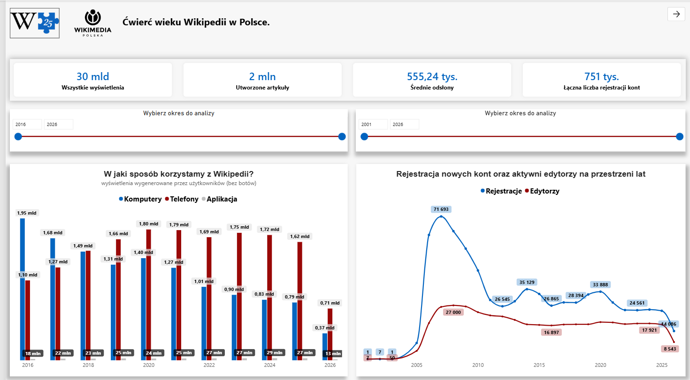
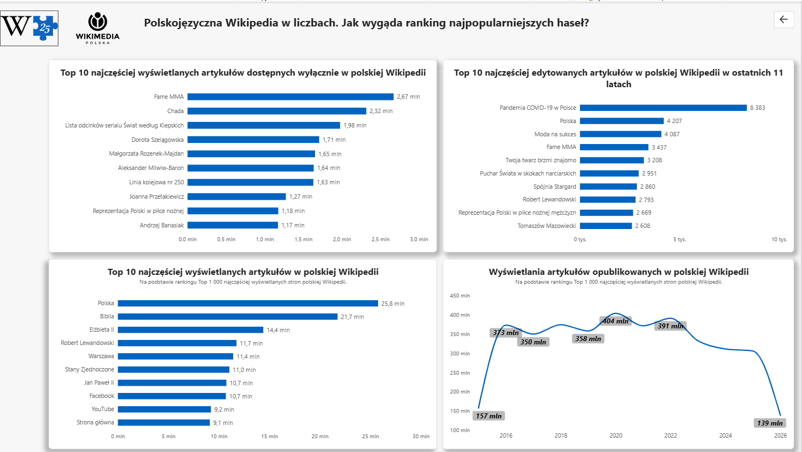

# 📊 25 lat Wikipedii w Polsce – analiza danych w Power BI

## 🎯 O projekcie

Projekt został przygotowany w ramach **III edycji wolontariatu #BI_NGO (Business Intelligence dla NGO)** organizowanego przez **Język Danych**.

Tematem edycji było **25-lecie polskojęzycznej Wikipedii** oraz analiza danych pokazujących rozwój, historię i sposób korzystania z jednej z najważniejszych inicjatyw związanych z otwartą wiedzą w Internecie.

W ramach projektu wolontariusze i wolontariuszki wykorzystują swoje kompetencje w zakresie analizy i wizualizacji danych, aby wspierać **Wikimedia Polska** w popularyzowaniu wiedzy o Wikipedii oraz przedstawianiu jej rozwoju w przystępnej i atrakcyjnej formie.

Wikipedia od 25 lat rozwija się dzięki społeczności osób, które wspólnie tworzą i rozwijają otwartą encyklopedię. Dane pozwalają spojrzeć na ten rozwój z innej perspektywy – pokazując m.in. zmiany w liczbie artykułów, popularności Wikipedii, aktywności użytkowników oraz zainteresowaniu poszczególnymi tematami.

### 💡 Cel projektu

Celem projektu było przekształcenie surowych danych dotyczących Wikipedii w **czytelny i interaktywny raport**, który pozwala analizować najważniejsze informacje oraz obserwować zmiany zachodzące na przestrzeni lat.

Raport został przygotowany w **Microsoft Power BI** i wykorzystuje interaktywne wizualizacje, filtry oraz miary analityczne.

---

## 📈 Raport Power BI

Raport przedstawia wybrane informacje dotyczące rozwoju polskiej Wikipedii oraz pozwala analizować dane za pomocą interaktywnych wizualizacji.

### Główne elementy raportu:

- 📊 analiza zmian w czasie,
- 👥 analiza aktywności użytkowników i społeczności,
- 📚 analiza rozwoju liczby artykułów,
- 👀 analiza popularności Wikipedii,
- 🔎 analiza najpopularniejszych treści,
- 📈 porównywanie danych w różnych okresach,
- 🎛️ interaktywne filtry i segmentatory,
- 📊 wizualizacje przygotowane zgodnie ze stylistyką Wikimedia / Wikipedii.

---

## 🖥️ Prezentacja raportu

### Pierwsza strona

### Druga Strona

---

## 🗂️ Model danych

Raport został przygotowany z wykorzystaniem odpowiednio uporządkowanego modelu danych.

Model obejmuje m.in.:

- dane dotyczące Wikipedii,
- informacje czasowe,
- tabele pomocnicze,
- miary DAX,
- relacje pomiędzy tabelami.

Zastosowanie modelu danych pozwala na tworzenie interaktywnych analiz oraz dynamiczne reagowanie wizualizacji na wybór użytkownika.

---

## 🧮 Analiza danych

W projekcie wykorzystałem m.in.:

- **Power Query** – przygotowanie i transformacja danych,
- **DAX** – tworzenie miar i obliczeń,
- **modelowanie danych** – tworzenie relacji pomiędzy tabelami,
- **wizualizacje Power BI** – prezentacja wyników,
- **segmentatory i filtry** – interaktywna analiza danych.

Raport został zaprojektowany tak, aby użytkownik mógł samodzielnie eksplorować dane i sprawdzać zależności pomiędzy poszczególnymi zmiennymi.

---

## 🔎 Pytania analityczne

Raport pozwala odpowiedzieć m.in. na pytania:

- Jak Wikipedia rozwijała się na przestrzeni lat?
- Jak zmieniała się popularność Wikipedii?
- Jak rozwijała się liczba artykułów?
- Jak zmieniała się aktywność społeczności?
- Które tematy cieszyły się największym zainteresowaniem?
- Jak wyglądały trendy w różnych okresach?
- Jak można przedstawić 25 lat rozwoju Wikipedii za pomocą danych?

---

## 🛠️ Wykorzystane narzędzia

| Narzędzie | Zastosowanie |
|---|---|
| **Microsoft Power BI** | analiza i wizualizacja danych |
| **Power Query** | czyszczenie i transformacja danych |
| **DAX** | tworzenie miar i obliczeń |
| **GitHub** | dokumentacja i prezentacja projektu |

---

## 📊 Źródła i kontekst projektu

Projekt powstał w ramach inicjatywy **#BI_NGO – Business Intelligence dla NGO**, której celem jest wykorzystanie kompetencji związanych z analizą danych i wizualizacją do wspierania organizacji społecznych.

III edycja projektu została poświęcona **25-leciu polskiej Wikipedii**, a partnerem i beneficjentem inicjatywy jest **Wikimedia Polska**.

Dane wykorzystane w ramach inicjatywy obejmują różne aspekty funkcjonowania Wikipedii, m.in. liczbę artykułów, wyświetlenia, aktywność użytkowników oraz historię edycji.

Więcej informacji:

- [#BI_NGO – Język Danych](https://bingo.jezykdanych.pl/)
- [Wikimedia Polska – 25 lat polskiej Wikipedii](https://wikimedia.pl/25-lat-polskiej-wikipedii/)
- [Wikimedia Polska](https://wikimedia.pl/)

---

---

---

## 👤 Autor

**Michał Wojdat**

Projekt przygotowany jako część wolontariatu **#BI_NGO** poświęconego 25-leciu polskiej Wikipedii.
